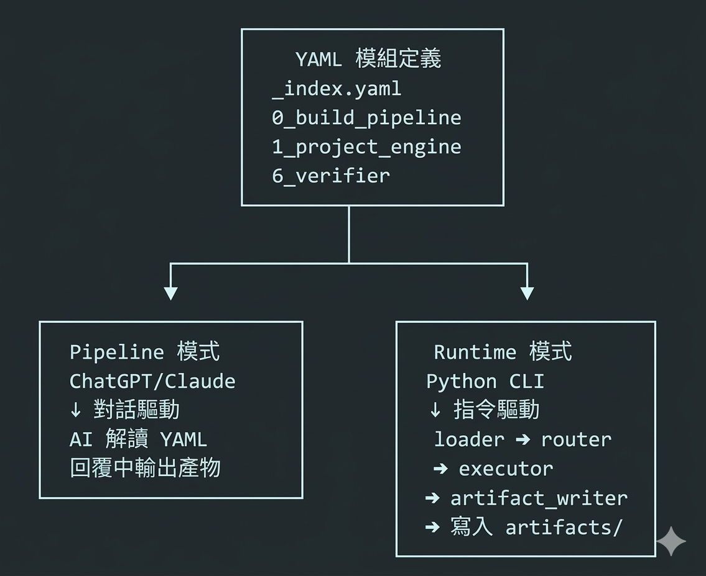

# ExpertAI Course Engine · YAML Pipeline

> AI 課程自動化生成系統 — 從主題到交付，一套 YAML 驅動全流程

接收課程主題與參數，自動產出講義、SDD、投影片文本、品質報告與交付包，並透過 Meta Loop 持續自我優化。



---

## 兩種執行模式

| 比較 | Pipeline 模式 | Runtime 模式 |
|------|:------------:|:------------:|
| 執行環境 | ChatGPT / Claude 對話視窗 | 本地 Python CLI |
| 驅動方式 | 貼入 YAML → AI 模擬執行 | `python -m runtime.main` |
| 適用場景 | 快速原型、單次生成 | CI/CD、批次生成、團隊協作 |
| 產物輸出 | AI 回覆中複製 | 直接寫入 `artifacts/` |
| 需要 API Key | 否 | Route B 不需要 / Route A 需要 |
| 詳細文件 | [PIPELINE_GUIDE.md](readme/PIPELINE_GUIDE.md) | [RUNTIME_GUIDE.md](readme/RUNTIME_GUIDE.md) |

---

## 快速開始（Runtime 模式）

```powershell
cd yaml_pipeline_explainer
python -m venv .venv
.\.venv\Scripts\Activate.ps1
pip install -r requirements.txt
copy .env.example .env          # 預設 ENGINE_MODE=B（本地模板，不需 API Key）
python -m runtime.main build --topic "AI 系統設計工作坊" --days 2 --modules 4
```

> 切換至 Route A（LLM 生成）：在 `.env` 設定 `ENGINE_MODE=A` 並填入 `OPENAI_API_KEY`。

---

## /build Pipeline 執行流程

```
/build → 0_build_pipeline（依序 7 步）
 ├─ Step 1 → 1_project_engine       → outline.yaml
 ├─ Step 2 → 2_handout_generator    → handouts/*.md
 ├─ Step 3 → 3_sdd_generator        → sdd/*.yaml
 ├─ Step 4 → 4_gamma_generator      → gamma/*.md
 ├─ Step 5 → 6_verifier             → verify.md
 ├─ Step 6 → 7_packager             → bundles/*.zip
 └─ Step 7 → 5_notifier             → Email / LINE
```

---

## 模組總覽（10 個 YAML 模組）

| # | 檔案 | 職責 |
|---|------|------|
| 0 | `0_build_pipeline.yaml` | 一鍵建置流程 · 總指揮 |
| 1 | `1_project_engine_4.0.yaml` | 課程骨架 × 教案引擎 |
| 2 | `2_learner_handout_generator.yaml` | 學員講義生成器 |
| 3 | `3_sdd_auto_generator.yaml` | App SDD 自動化生成 |
| 4 | `4_gamma_generator.yaml` | 投影片文字生成器（Gamma 用） |
| 5 | `5_notifier_auto_dispatch.yaml` | 學員通知 × Email / LINE 自動寄送 |
| 6 | `6_verifier_auto_checker.yaml` | 產物品質檢核與修復 |
| 7 | `7_packager_auto_zipper.yaml` | 模組成果打包 ZIP 交付 |
| 8 | `8_bridge_connector.yaml` | 外部資料橋接（Sheets / Airtable / Notion） |
| 9 | `9_meta_loop.yaml` | 課程更新 × 持續學習追蹤 |

---

## 專案結構

```
yaml_pipeline_explainer/
├─ _index.yaml              # 指令對照表與模組索引
├─ 0～9_*.yaml              # 10 個 YAML 模組定義
├─ runtime/                 # Python 執行層（CLI）
│  ├─ main.py               #   入口 + argparse
│  ├─ loader.py             #   讀取 YAML
│  ├─ router.py             #   指令 → 模組路由
│  ├─ executor.py           #   步驟執行（Route A/B 雙模式）
│  ├─ artifact_writer.py    #   統一寫入 artifacts/
│  └─ utils.py              #   共用工具
├─ artifacts/               # 產物輸出（handouts/ sdd/ gamma/ _reports/）
├─ prompts/                 # 生成模板（講義 / SDD / Email / LINE）
├─ readme/
│  ├─ PIPELINE_GUIDE.md     # ChatGPT / Claude 操作指南
│  └─ RUNTIME_GUIDE.md      # Python Runtime 操作指南
├─ CLAUDE.md                # Claude Code System Prompt
├─ .env.example             # 環境變數範本（ENGINE_MODE / API Key）
└─ requirements.txt         # Python 依賴（pyyaml, openai, python-dotenv）
```

---

## 文件索引

| 文件 | 說明 |
|------|------|
| [PIPELINE_GUIDE.md](readme/PIPELINE_GUIDE.md) | 在 ChatGPT / Claude 中以對話方式操作的完整指南 |
| [RUNTIME_GUIDE.md](readme/RUNTIME_GUIDE.md) | 在本地以 Python CLI 執行的完整指南（含 VS Code 整合） |
| [CLAUDE.md](CLAUDE.md) | Claude Code 專用 System Prompt |

---

*ExpertAI Course Engine v4.1 · 從主題到交付，系統自動運作*

